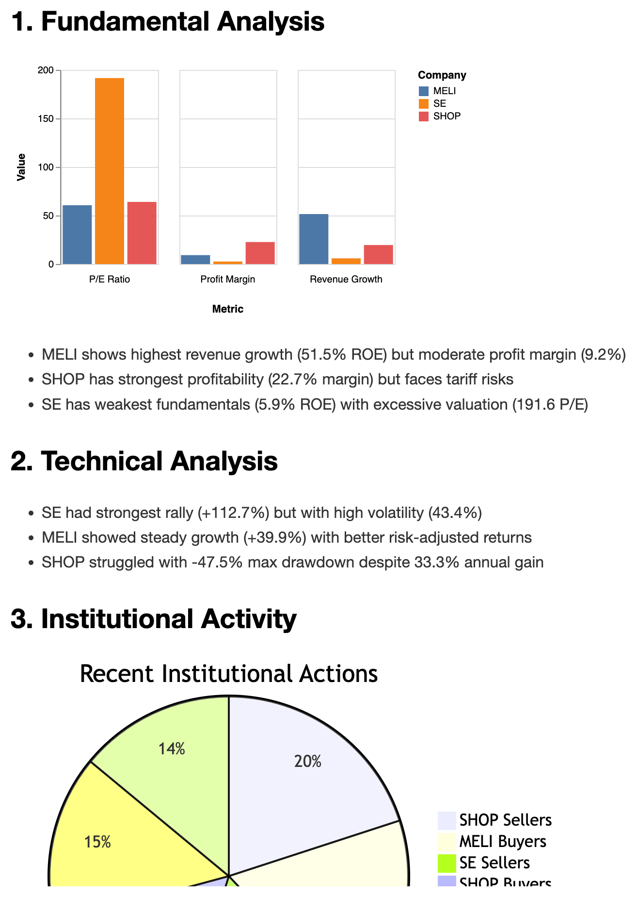

# finance-tools-mcp: A Financial Analysis MCP Server
> https://github.com/VoxLink-org/finance-tools-mcp

## Overview

The **finance-tools-mcp** is a Model Context Protocol (MCP) server designed to provide comprehensive financial insights and analysis capabilities to Large Language Models (LLMs). Modified from [investor-agent](https://github.com/ferdousbhai/investor-agent), it integrates with various data sources and analytical libraries to offer a suite of tools for detailed financial research and analysis.

<a href="https://glama.ai/mcp/servers/@VoxLink-org/finance-tools-mcp">
  
</a>


## Tools Offered

The server exposes a variety of tools via the MCP, allowing connected clients (like LLMs) to access specific financial data and perform analyses:

*   **Ticker Data Tools:**
    *   `get_ticker_data`: Provides a comprehensive report for a given ticker, including overview, news, key metrics, performance, dates, analyst recommendations, and upgrades/downgrades.
    *   `get_options`: Retrieves options data with the highest open interest for a ticker, with filtering options for date range, strike price, and option type (Calls/Puts).
    *   `get_price_history`: Fetches historical price data digest for a specified period, including OHLCV samples, Technical Indicators, Risk Metrics, and other quantitative analysis.
    *   `get_financial_statements`: Accesses financial statements (income, balance, cash flow) for a ticker, available quarterly or annually.
    *   `get_institutional_holders`: Lists major institutional and mutual fund holders for a ticker.
    *   `get_earnings_history`: Provides earnings history with estimates and surprises for a ticker.
    *   `get_insider_trades`: Retrieves recent insider trading activity for a ticker.
    *   `get_ticker_news_tool`: Fetches the latest Yahoo Finance news for a specific ticker.

*   **Fear & Greed Index Tools:**
    *   `get_current_fng_tool`: Gets the current CNN Fear & Greed Index score and rating.
    *   `get_historical_fng_tool`: Retrieves historical CNN Fear & Greed Index data for a specified number of days.
    *   `analyze_fng_trend`: Analyzes trends in the CNN Fear & Greed Index over a specified period.

*   **Calculation Tools:**
    *   `calculate`: Evaluates mathematical expressions using Python's math syntax and NumPy.

*   **Macro Data Tools:**
    *   `get_current_time`: Provides the current time.
    *   `get_fred_series`: Retrieves data for a specific FRED series ID.
    *   `search_fred_series`: Searches for popular FRED series by keyword.
    *   `cnbc_news_feed`: Fetches the latest breaking world news from CNBC, BBC, and SCMP.

## Time Series Data Processing and Optimization

The server utilizes `yfinance` to retrieve historical price data (OHLCV - Open, High, Low, Close, Volume) for tickers. This raw data undergoes significant processing and analysis to provide valuable insights, particularly optimized for consumption by LLMs.

Key aspects of the time series data handling include:

*   **Comprehensive Analysis:** The data is analyzed using libraries like `ta-lib-python` to calculate a wide range of technical indicators. Additionally, custom functions compute basic statistics, risk metrics, recognize common chart patterns, and calculate Fibonacci retracement levels.
*   **Structured Digest:** The results of this analysis are compiled into a structured digest format (`generate_time_series_digest_for_LLM`) that is easy for LLMs to parse and understand, including sections for statistics, summary, technical indicators, risk metrics, patterns, Fibonacci levels, and a data sample.
*   **Smart Sampling for LLMs:** To provide LLMs with a representative view of historical data without overwhelming the context window, a "smart sampling" strategy is employed (`get_latest_data_sample`). This method samples the data with varying resolutions:
    *   **High Resolution:** Recent data points are included daily.
    *   **Medium Resolution:** Intermediate data points are sampled weekly.
    *   **Low Resolution:** Older data points are sampled monthly.
    This hybrid approach ensures that the LLM receives detailed information about recent price movements while still having context about longer-term trends, all within a manageable number of data points.

This optimized processing and presentation of time series data allows LLMs to quickly grasp key trends, indicators, and patterns, facilitating more informed financial analysis.

## Sample Report


## Prerequisites

*   **Python:** 3.10 or higher
*   **Package Manager:** [uv](https://docs.astral.sh/uv/)

## Installation

First, install **uv** if you haven't already:

```bash
curl -LsSf https://astral.sh/uv/install.sh | sh
```

Then, you can run the **finance-tools-mcp** MCP server using `uvx`:

```bash
uvx finance-tools-mcp
```

If you want to use your own FRED API key, you can set it as an environment variable:

```bash
FRED_API_KEY=YOUR_API_KEY uvx finance-tools-mcp
```

You can also run the server using Server-Sent Events (SSE) transport:

```bash
uvx finance-tools-mcp --transport sse
```

Or with the FRED API key and SSE transport:

```bash
FRED_API_KEY=YOUR_API_KEY uvx finance-tools-mcp --transport sse
```

## Usage with MCP Clients

To integrate **finance-tools-mcp** with an MCP client (for example, Claude Desktop), add the following configuration to your `claude_desktop_config.json`:

```json
{
  "mcpServers": {
    "investor": {
        "command": "path/to/uvx/command/uvx",
        "args": ["finance-tools-mcp"],
    }
  }
}
```

## Debugging

You can leverage the MCP inspector to debug the server:

```bash
npx @modelcontextprotocol/inspector uvx finance-tools-mcp
```

or

```bash
npx @modelcontextprotocol/inspector uv --directory  ./ run finance-tools-mcp
```

For log monitoring, check the following directories:

*   macOS: `~/Library/Logs/Claude/mcp*.log`
*   Windows: `%APPDATA%\Claude\logs\mcp*.log`

## Development

For local development and testing:

1.  Use the MCP inspector as described in the [Debugging](#debugging) section.
2.  Test using Claude Desktop with this configuration:

```json
{
  "mcpServers": {
    "investor": {
      "command": "path/to/uv/command/uv",
      "args": ["--directory", "path/to/finance-tools-mcp", "run", "finance-tools-mcp"],
    }
  }
}
```

## License

This MCP server is licensed under the MIT License. See the [LICENSE](LICENSE) file for details.

## Samples
- [carvana_analysis.md](reports/carvana_analysis.md)
- [palantir_analysis.md](reports/palantir_analysis.md)
- [pdd_analysis_20250503.md](reports/pdd_analysis_20250503.md)
- [meli_se_shop_comparison_20250504.md](reports/meli_se_shop_comparison_20250504.md)

## Todo
- [ ] Add supporting levels and resistance levels for stocks
- [x] Add Fibonacci retracement levels for stocks
- [ ] Add moving average confluence levels for stocks
- [ ] Add option model for prediction
- [ ] Add predictive model by using finance sheets and other features
 